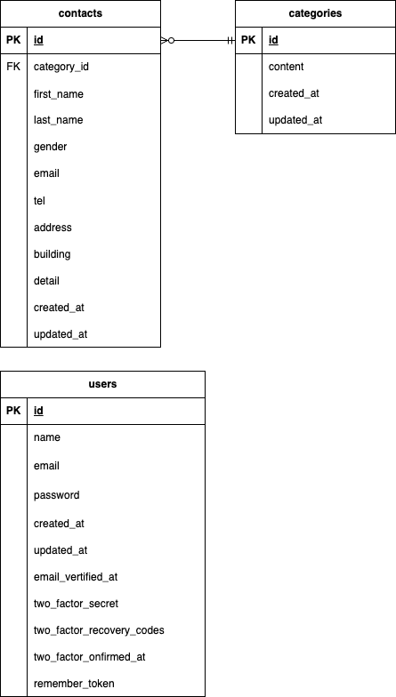

# Fashionably Late

## 環境構築

### Docker ビルド

1. git リポジトリをクローンする
 ```bash
 mkdir test-unokuchi
 cd test-unokuchi
 git clone git@github.com:kasumiunokuchi-afk/fashionably-late.git
 cd fashionably-late
 ```

2. Docker をビルドする
 ```bash
 docker-compose up -d --build
 ```

### Laravel 環境構築

1. php コンテナにログイン
 ```bash
 docker-compose exec php bash
 ```

2. パッケージをインストール
 ```bash
 composer install
 ```

3. 環境変数の設定
 ```bash
 cp .env.example .env
 exit
 code . 
 ```

.env作成後、vscodeを使用して以下の変更を行う。
```
修正ファイル： .env

<変更前>
DB_CONNECTION=mysql
DB_HOST=127.0.0.1
DB_PORT=3306
DB_DATABASE=laravel
DB_USERNAME=root
DB_PASSWORD=

<変更後>
DB_CONNECTION=mysql
DB_HOST=mysql
DB_PORT=3306
DB_DATABASE=laravel_db
DB_USERNAME=laravel_user
DB_PASSWORD=laravel_pass

```


5. php コンテナに再ログイン
 ```bash
 docker-compose exec php bash
 ```

6. アプリケーション用KEYの作成
 ```bash
 php artisan key:generate
 ```

7. DBのマイグレーション
 ```bash
 php artisan migrate
 ```

 8. シーディングの実行
 ```bash
 php artisan db:seed
 ```


### 開発環境

- お問い合わせフォーム　
  http://localhost/

- ユーザ登録
  http://localhost/register

- 管理画面
  http://localhost/admin

## 使用技術（実行環境）

- PHP : 8.1.33
- Laravel : 8.83.8
- mysql : 8.0.26
- nginx : 1.21.1

## ER 図
